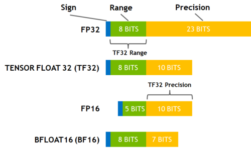
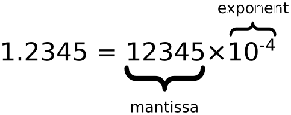
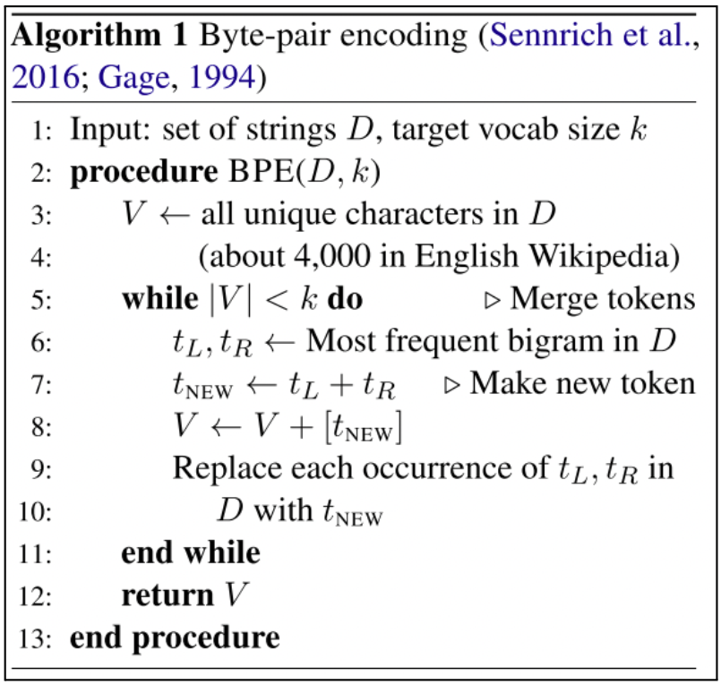

# ML Reference

## Data Preprocessing
* Installation:
    ```sh
    pip install datasets evaluate transformers
    ```
* Load datasets directly from the [HuggingFace Hub](https://huggingface.co/docs/datasets):
    ```python
    from datasets import load_dataset
    dataset = load_dataset("glue", "mrpc", split="train", cache_dir="PATH", download_mode="XXXX")
    ```
* Prefer **🤗 `datasets`** over **`pandas`** for ML/NLP pipelines due to its efficient Apache Arrow backend, fast `map`/`filter`/`shuffle` operations, streaming support, multiprocessing, and seamless integration with the Hugging Face ecosystem.
* Common packages: `datasets.*` (`datasets.Dataset` and `datasets.DatasetDict`) (from HuggingFace), and `torch.utils.data.*` (`torch.utils.data.DataLoader` and  `torch.utils.data.Dataset`) (from PyTorch). 
* `datasets.DatasetDict` — a dictionary of dataset splits.
* In `datasets.Dataset` class have attribute of  dataset.column_names, dataset.features, dataset.shape, dataset.split, etc.
* In `datasets.Dataset` class have a extremley import `map` method for transforming dataset. Please observe that, especially in handling batching and adding and extracting columns/features. 
* In `datasets.Dataset` class have a group of method for filtering a feature/coulumn, deleteing a featurte, renaming a feature, casting a feature, shuffling, sorting, adding a new features/colum.
* `datasets.Dataset` can be converted into csv, dict, arrow (explain in a line why arrow) format and vice versa.
* Before loading `datasets.Dataset` into dataloader, its colums/features need to converted with require data type through `datasets.Dataset.with_format(*)` or `datasets.Dataset.set_format(*)`
* `datasets.Dataset` can be spilletd like python list, but never retrieve entire column of a large `datasets.Dataset`.
* Often huggingface use caching, remove caching by,
    ```python
    dataset.cleanup_cache_files()
    dataset_dict.cleanup_cache_files()
    ```

## Quantization

* [Practical Quantization in PyTorch](https://pytorch.org/blog/quantization-in-practice/).
* Read `QLoRA` paper carefully.
* 

### Regarding QLoRA




* In the above figure, range means exponent, precision means mantissa.
* In bfloat16 (BF16), 8 bits are reserved for the exponent (which is the same as in FP32) and 7 bits are reserved for the fraction. Now there is absolutely no problem with huge numbers, but the precision is worse than FP16 here.
* In the Ampere architecture, NVIDIA also introduced TensorFloat-32 (TF32) precision format, combining the dynamic range of BF16 and precision of FP16 to only use 19 bits. It's currently only used internally during certain operations.
* In the machine learning jargon FP32 is called full precision (4 bytes), while BF16 and FP16 are referred to as half-precision (2 bytes).


## Human Annotations
Essentials related to human evaluation and crowd sourcing.
* Create separate conda environment
* Agreement among crowdworkers: NLTK tools.
* Crowdworker confidence: "Learning whom to trust with MACE" Paper.
* Tools: "Doccano"
* Inter-rater agreements use `nltk.metrics.agreement`. Use fleiss kappa and kripendoff alpha mostly.
* Beware of some fallacy. See this [link](https://stackoverflow.com/questions/45353866/nltk-inter-annotator-agreement-using-krippendorff-alpha).


## Sklearn
* Training function
    * For unsupervised: `fit`, `transform`, `fit_transform`.
    * For supervised: `fit`, `predict`.
* Metrics `sklearn.metrics`
    * accuracy, confusion matrix, mean squared error, adjusted rand score (for clustering).
* Clustering quality evaluation [(link)](https://www.researchgate.net/post/How_can_I_test_the_performance_of_a_clustering_algorithm).
    * External evaluation: E.g. accuracy, f-measure, rand index etc.
    * Internal evaluation: E.g. Silhouette index, Elbow method etc.
* Algorithm are, PCA, t-SNE, KNN, SVM, SVR, 
* For Smoothing a line we can use iterpolation by `scipy.interpolate`, like `scipy.interpolate.CubicSpline`


## Plotting
* Using `matplotlib.pyplot`.
* Two imporat concept in canvas of `scipy.interpolate`, figures and axes. Figure contains multple axes. 
```python
    fig, axs = plt.subplots(nrows=2, ncols=2)
    a1 = axs[0, 0].plot(..)
    a2 = axs[0, 1].bar(x=x_list, height=y_list, width=0.5, color="blue")
    a3 = axs[1, 0].boxplot(..)
    a4 = axs[1, 1].scatter(..)
```
* You can do line, bar, scatter, box, violin, etc plot. There are various point markder, style, and text annonation tools.
* For color value ranges one can use cmap, there are diffrent type of cmap.
* In line, bar plots you can add error bars for showing errors.
* To fill inbeteen two line plot, you can also use `fill_between`.
* Always save plot in pdf format with appropriate dpi in `.savefig` method. And must use tight layout and maintain other staffs for compact representation.
* For an 2D-array use matshow: `matplotlib.pyplot.axes,matshow(array, cmap)`.
* To deal with image in `matplotlib.pyplot` use `imread`, `imshow`.


# Tokenizer
* Divided into two parts---Mechanisms and Implementation (through huggingface).

## Mechanisms
* We have shown three important tokenizers here---BPE, wordpiece and unigram language modelling tokenizer.

### Byte-pair encoding
* Vocabulary starts with characters and grows by concatenating highly frequent terms.
* Calculate the weightage of tokens in terms of frequency.
* Concatenations are stored according to frequencies.
* **Inference**: Apply rules in a top-down fashion (*!curious*).

    

### Wordpiece tokenizer
* Not open-source (introduced by Google).
* Similar to BPE, except the weightage of tokens is calculated through mutual information apart from frequencies.
* **Inference**: Start from the beginning in the search for the largest token. (just like Chinese segmentation)

    

### Unigram language modelling tokenizer
* Opposite to BPE/Wordpiece: Start with a large set of vocabulary, then shrink to a target-sized vocabulary.
* Discard token by minimizing unigram language model loss. 

---
## Implementation
* Two ways 
    * From `tokenizers` library.
    * Pretrained tokenizers from `transformers`. Here we mainly discuss these.     
* A special feature of these tokenizers is full alignment tracking.
* Base pretrained tokenizer class, `transformers.PreTrainedTokenizerBase`.
* Fast (Rust) pretrained tokenizer, `transformers.PreTrainedTokenizerFast`.
* Slow pretrained tokenizer, `transformers.PreTrainedTokenizer`.
* In vocabulary, there are several special tokens in a tokenizer.
* Each `transformers.PreTrainedTokenizerFast` has a backend `tokenizers.Tokenizer`.
    ```python
    from transformers import BertTokenizerFast
    tokenizer = BertTokenizerFast.from_pretrained("bert-base-uncased")
    print("Is it a Fast tokenizer {0}.".format(tokenizer.is_fast))
    backend_tokenizer = tokenizer.backend_tokenizer
    ```
* We can train fast tokenizer from text corpus.


### Stages (pipeline) for tokenizer
1. **Normalization** Employs `.normalize_str(string)` method to normalize string.
2. **Pre-tokenization**: Employs `.pre_tokenize_str(string)` method to splitting string. 
3. **Model**: There are few models like Wordpiece, Unigram, BPE and Wordlevel.
4. **Post-processing**: Add special tokens and segment ids. 
6. **Encoding**: From string to token ids.
5. **Decoding**: From token ids to string.

## Imprtant arguments for encoding and decording in tokenizer
* padding
* truncation
* max_length
* return_length
* return_tensors
* return_attention_mask
* return_special_tokens_mask
* return_token_type_ids 