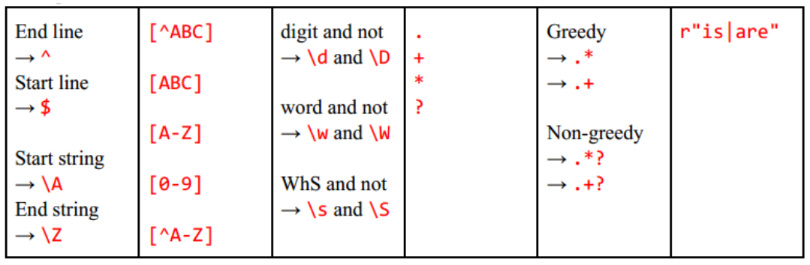
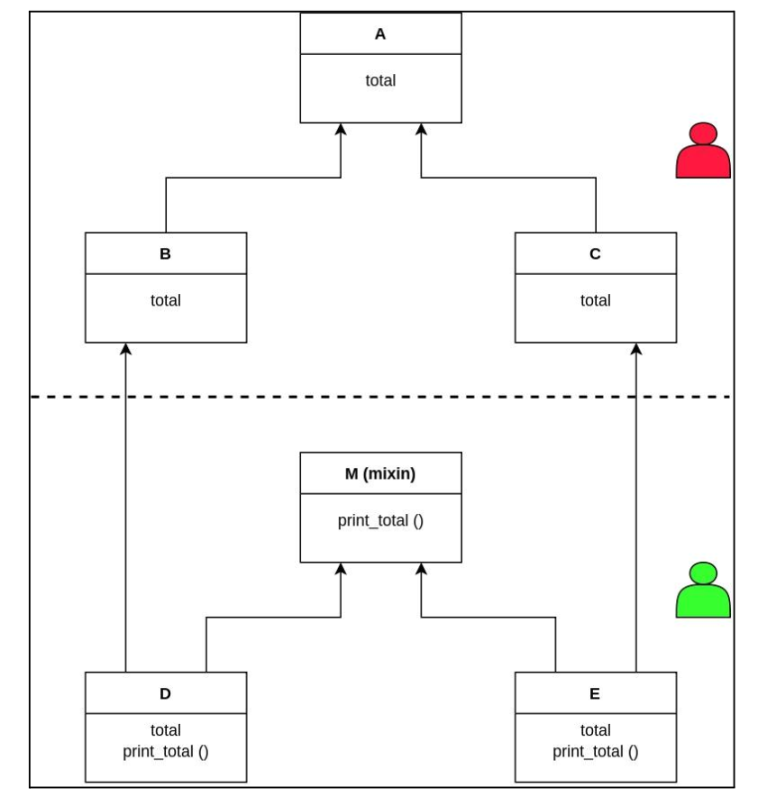

# Python

## Basics and My Superstitions

* **Object-oriented and multi-paradigm.** Everything in Python is an object, including classes and functions. Functions can be passed as arguments, returned from other functions, and assigned to variables. This supports functional programming and metaprogramming techniques such as decorators (e.g., `@staticmethod`).

* In Python, **mutable objects** (e.g., `list`, `dict`, and `set`) can be modified after creation, whereas **immutable objects** (e.g., `int`, `str`, and `tuple`) cannot be modified after creation. An operation that appears to modify an immutable object instead creates or returns a different object.

* When a mutable object is passed to a function, the function receives a reference to the same object. If the object is modified in-place (e.g., with `.append()`), the modification is visible outside the function. Python is often described as using **pass-by-object-reference** or **pass-by-object-sharing**.

* **Mutability and hashability are separate concepts.** Most mutable built-in containers, such as `list`, `dict`, and `set`, are unhashable and therefore cannot be used as dictionary keys. Immutable objects such as `int` and `str` are generally hashable, although hashability ultimately depends on the object's type.

* Some useful attributes -> `__doc__` (docstring), `__name__` (designation), `__file__` (module path), `__base__` (immediate base class).

* **SEQUENCE** (Ordered and Indexed; like `list`, `tuple`, `str`, `range`, etc.) vs **Non-SEQUENCE** (Unordered/No Index; like `dict`, `set`, `generator`, etc.)  

* **Iterable vs Iterator**
    * An iterable is any object that can return its elements one at a time.
    * An **iterable** is an object that can return an iterator, typically through `__iter__()`.
    * An iterator is a stateful object that remembers its current position during a loop. 
    * `iterator` provides the `__next__()` method.
    * Example: a list is iterable, while `iter(list_object)` returns an iterator over the list.
    * When you write a standard Python loop like `for item in list_object:`, Python secretly converts the iterable into an iterator behind the scenes.

* * A useful conceptual relationship is: **Iterable → Iterator → Generator**. A generator is an iterator, while an iterator is an iterable. However, not every iterable is an iterator.

* **Generator.** A generator is a type of iterator commonly created by a generator function containing `yield`, or by a generator expression.

* **Deepcopy vs Shallowcopy** 
    * With `copy` module

        ```python
        import copy 
        a = copy.deepcopy(object_t) # 
        ```
    * **Copying a list.** `b = list(a)` creates a new list, but performs a **shallow copy**. Nested mutable objects are still shared.

* **Preferred `Collections`.** `counter`, `named_tuple`, `OrderedDict`, `default_dict`.

* **Lambda/Inline function.** `square = lambda x: x*x`

* Global variable calling from inside a function -> `global x`

* **Underscore conventions**
    * `_name`: A convention indicating that a name is intended for internal use. Names beginning with a single underscore are not imported by `from module import *` unless explicitly included in `__all__`.
    * `__name__`: A predefined "dunder" (double-underscore) attribute used in several contexts, such as identifying a module or class. User-defined dunder names should generally follow Python's documented protocols.
    * `__name`: Inside a class, a name beginning with two underscores and not ending with two underscores is subject to **name mangling**. For example, `__name` in class `FooBar` becomes `_FooBar__name`.
    * `name_`: A trailing underscore is conventionally used to avoid conflicts with reserved words or existing names.

## Arguments and Imports

* In Python, `*` and `**` are used for unpacking and argument passing.
    * Example: `print(*[1, 2, 3])` is equivalent to `print(1, 2, 3)`.
    * For merging/unpacking: `combined = [*list1, *list2]` and `merged = {**dict1, **dict2}`.

* **Variable-length arguments.** `*args` collects positional arguments into a tuple. `**kwargs` collects keyword arguments into a dictionary.

```python
def function(arg1, *args, arg2=None, **kwargs):
    ...
```

* Dictionary methods such as `.get(key, default)` and `.pop(key, default)` can be used to access or remove values with an optional default.

* `inspect.signature(function)` returns the signature of a callable, and `inspect.signature(function).parameters` provides its parameters.

* A bare `*` in a function signature makes all parameters that follow it **keyword-only**.

* `sys` module:
        * Standard streams: `sys.stdin`, `sys.stdout`, and `sys.stderr`.
        * Module search path: `sys.path`.
        * Command-line arguments: `sys.argv`.
        * Information about the Python executable: `sys.executable`.

* Use the `argparse` module for parsing command-line arguments.

* **Importing Hazard**:
    * The package's `__init__.py` controls what is initialized when the package itself is imported.
    * Add to the module search path
        
    ```python
        import os, sys
        sys.path.append(os.path.abspath(os.path.join(__file__, "..")))
    ```

## Controlling

* **Control Statement**
    * If statement -> `if condition: XXXXX elseif condn: XXXXX else: XXXXX`
    * For statement -> `for i in range(start, end+1, inc)`.
    * Related keyword -> `break`, `continue` and `pass`.

* **`with`**
    * The `with` statement is commonly used with a **context manager**. A context manager implements the context-management protocol, typically through `__enter__` and `__exit__`.
    * The main advantage of `with` is that the context manager's cleanup logic is executed when the `with` block exits, including when an exception occurs.

        ```python
        with open("output.txt", "w") as f:
            f.write("Hi there!\n")
        ```

* **`id(object)`**
    * Returns an integer representing the object's identity. The identity is guaranteed to be unique among simultaneously existing objects. In CPython, this is typically related to the object's memory address, but this behavior should not be assumed for Python implementations in general.
    * `id()` and the `is` operator are related to **object identity**. `a is b` checks whether `a` and `b` refer to the same object.
    * The `==` operator checks for **value equality**, as defined by the objects' equality implementation.
    * **Important:** Python implementations may reuse object identities after an object is destroyed. CPython also commonly reuses certain immutable objects, such as small integers and some strings, but code should never rely on two equal values having the same `id()`.

* **Membership and identity checks.** `is` checks object identity. `in` and `not in` check membership.


## Sequence and Non-sequence

* Initialization
    * `tuple()`, `dict()` (or `{}`), `list()` (or `[]`), `set()`, etc.
    * WARNING single element tuple -> `(x,)`.

* Dictionary
    * Clear and delete -> `*.clear()` and `del dictA`.
    * Dictionary to list of tuple and reverse -> `*.items()` and `dict.from_keys(keys, value)`
    * Keys and values -> `*.keys()` and `*.values()`
    * Search -> `if key in dictA:`.
    * `.get(key, default)` and `.pop(key, default)`

* String
    * Raw string -> `r"string"` (raw)
    * Encoding -> `*.encode(encoding='utf-8', errors='strict')`
    * Decoding -> `*.decode(encoding='utf-8', errors='strict')` (errors can be 'ignore')
    * Splitting -> `.split(" ", num)` 
    * Stripping -> `*.strip()`
    * Use `re.sub` for replace.
    * Lowercase -> `.islower()`, `*.lower()`   

* Count method
    * `count()` is available for several sequence types, including strings and lists. It counts occurrences of a value or substring.
    * Usecase -> `.count(content)`.

* Sequence
    * Index find -> `*.index(value)`
    * Insert in a position -> `*.insert(index, value)`
    * Enumerate for loop -> `for i, j in enumerate(sequence)`
    * Delete an element with destructor -> `del sequence[index]`, use `.pop(index=-1)` to remove and show both.
    * Indexing -> `sequence[i:j]`,`sequence[i:j:k]`, `sequence[::-1]`. (reversing).
    * Sorting -> `*.sort(key=fn)`.
    * Joining by string -> `"xyx".join(sequence)`.
    * Expand -> `sequenceA.extend(sequenceB)` (or `sequenceA + sequenceB`) and `sequence.append(value)` (for single element).
    * Repeating a sequence -> `sequence * 10`


## Helpers

* **Useful built-ins and helpers**
    * `dir(module)`, `help(name)`, `name.__doc__` and `id(object)`.
    * `type(object)` -> Root traced to `class type`.
    * `class_name.__base__` -> Root traced to `object`.
    * `locals()` and `globals()`


## Utilities

* **Bitwise operators** -> `|` (or), `^` (xor), `!` (not), `&` (and), `>>` (right shift), `<<` (left shift).

* Math function -> `math.ceil`, `math.floor`, `math.log10`, `math.log2`, `math.pow(x, y)`, `math.sqrt`.

* Infinite and nan representation -> `float('inf')` and `float('nan')`

* WARNING (exponent) -> `**` (as bitwise or is `^`)

* Rounding -> `round(x [, n])`

* Numbering
    * Octal as `0NUM` (or `0oNUM`), hexadecimal as `0xNUM`  
    * Conversion -> `oct(num)`, `hex(num)`
    * Complex number -> `complex(x, y)` 
    * String to integer/float -> `int(digits, base=10)` and `float(digits)`
    * Char to int and vice versa -> `ord(character)` and `chr(value)`

* Regular expression (`re` module)
    * Error -> `re.error`.
    * Find -> `re.finditer(r'pattern', string, flags=re.I|re.S|re.M)` and `*.group(*)`.
    * Replace -> `re.sub(r'pattern', "abc \x", string, num)` where group `'\x'`.
    * Split -> `re.split(r'pattern', string, maxsplit, flags)`.
    * Symbols
        
        

* Time (`import time`): methods for getting time (Unix epoch and human-readable), pausing execution.

* Random (`import random`)
    * Seed -> `random.seed(seed)`
    * Random value -> `random.random()`
    * Shuffle a list -> `random.shuffle(listA)`
    * Select a element -> `random.choice(sequence)`


## File and Storage

* File Management
    * Open ->  `open(file_name, mode=['x'|'x+'|'xb+'], encoding="utf-8")` where `x` can be either of `'a'`, `'r'` and `'w'`.
    * Close -> `.close()`. Default practice should be with `with`.
    * Read and write text using `.read()` and `.write(text)`. When working in binary mode, `.read()` and `.write()` operate on bytes rather than strings.
    * `seek` and `tell` methods are there.

* `os` module
    * `os.getcwd()` (get current directory), `os.listdir(path)` (list all files and directories), `os.chmod(path, mode)` (change mode), and `os.chdir(path)` (change path).
    * `os.remove(file_path)`and `os.rmdir(dir_path)`.
    * `shutil.rmtree(directory_name)` — recursively remove a directory and its contents. Use with caution.

        ```python
        import shutil
        shutil.rmtree(directory_name)
        ```
    * `os.mkdir(path)`.
    * `os.rename(old, new)` and `os.renames(old, new)` (may be for directory).
    * `os.path.abspath(local_name)`, `os.path.join(path1, path2)`.

## Exception handling

* Base class -> `Exception`.

* Raising -> `raise Exception("message")`

* Assertion -> `assert condition, "message"`

* See following,

    ```python
    try:
        pass
    except(Exception1 as e1,...,ExceptionN as eN):
        print(e1, ..., eN)
        print(e1.args)
    else: # optional
        # will be executed when no exception occurs.
        pass
    finally: # optional
        # will be always executed even when exceptions are occurred.
        pass
    ``` 


## Typing in python

* Python is **dynamically typed**: variable names are not restricted to a single type. Python also supports optional **type annotations**, which can be checked by external tools such as `mypy` (`pip install mypy`).

* For variables,
    
    ```python
    a:int = 2
    b:str = "joy"
    ```
* Similarly, for other `bool`, `float`, `int`, `list`, `tuple`, `dict`, etc.

* For functions,

    ```python
    def sample(name:str, rank:int=1) -> int:
        return rank
    ```

* The `typing` module provides additional typing constructs. In modern Python, built-in generic types are often preferred:

    ```python
    from typing import Any, Optional, Union

    a: list[str] = ["a", "b"]
    b: tuple[int, str] = (10, "a")
    c: dict[str, str] = {"name": "dog"}

    d: Union[int, str] = "dog"
    e: Optional[str] = None

    g: Any = "anything"
    ```

* In newer Python, the following forms are equivalent:

    ```python
    Optional[X]
    X | None
    Union[X, None]
    ```

    The `X | None` syntax is generally preferred in modern Python.


## Reproducibilty with OOP: Four Common Principles 

* **Encapsulation:** Bundle data and the methods that operate on that data within classes or objects, while controlling access through the class interface.

* **Abstraction:** Expose relevant interfaces while hiding unnecessary implementation details.

* **Inheritance:** Define a class in terms of another class. Python supports both single and multiple inheritance.

* **Polymorphism:** Different objects can provide different implementations of the same interface or operation. Python also supports operator overloading through special methods.

## Classes and Objects

* **class variable** is defined on the class and is shared through the class unless shadowed by an instance attribute. An **instance variable** is stored on an individual instance.

* Accessing a class variable through an instance does not turn it into an instance variable. Assigning to `self.name`, however, creates or updates an instance attribute named `name`.

```python
class A:
    name = "apple"

    def do_something(self):
        print(self.name)
        self.name = "orange"


if __name__ == "__main__":
    a = A()
    a.do_something()

    print(a.name)  # orange
    print(A.name)  # apple
```

* An **instance method** relies on `self` to access and modify data specific to a single, unique object. A **class method** uses the `@classmethod` decorator and receives `cls` to manage state or build objects across the entire class template. A **static method** uses `@staticmethod` and acts as an isolated utility function, operating independently without access to either instance or class data.

* Common special methods include -> `__init__(self, *)` (constructor), `__str__(self, *)` (string representation), `__del__(self)` (destructor), `__call__(self, *)` (for callable class), `__getitem__(self, key)` (indexing such as `obj[key]`), `__setitem__(self, key, value)` (assigning value through key).
    
* Useful built-in functions include -> `setattr(object, attribute, value)` (set attribute value), `getattr(object, attribute)` (get attribute value), `isinstance(object, class)` (whether instance or not), `issubclass(s_class, p_class)` (checking).
    
* `super()` returns a proxy object that delegates attribute lookup according to the method resolution order (MRO). It is **not simply a reference to the parent class**.
    
```python
super().__init__(*) 
parentclass.__init__(self, *) # another way
```

* Inside an instance method, the following are equivalent in the usual case:

```python
self.methodname(*)
ClassName.methodname(self, ...)
```

* `__new__` is responsible for creating an instance, while `__init__` initializes an already-created instance. When object creation proceeds normally, `__new__` is called before `__init__`.

### An Important Case: Name Conflicts Among Parent Classes in Multiple Inheritance

* In multiple inheritance, the **method resolution order (MRO)** determines the order in which Python searches for attributes and methods.

* The order of base classes in the class definition affects the MRO, but Python uses the full C3 linearization algorithm rather than simply giving unconditional priority to the first parent.

    ```python
    class A:
        def method(self):
            print("A")

    class B:
        def method(self):
            print("B")

    class C(A, B):
        pass

    C().method()
    ```

* `super()` does **not** simply denote the first-positioned base class. Instead, `super()` returns a proxy that performs attribute lookup according to the class's MRO.

* For any base class method access use `BASECLASS.methodname(self, X)`.

### Mixin

* A **mixin** is a class designed to provide reusable behavior to other classes through inheritance. It is commonly intended to be combined with other classes rather than instantiated as the primary application object, although Python does not technically prevent a mixin from being instantiated.



* See following codes,

    ```python
    class A():
        name = "I'm A"

    class B(A):
        pass

    class C(A):
        pass

    class M_mixin():
        def show_name(self):
        print("The name = ", self.name)

    class D(B, M_mixin):
        pass

    class E(C, M_mixin):
        pass

    if __name__ == "__main__":
        a = D()
        a.show_name()
        print(issubclass(type(a), A), issubclass(type(a), M_mixin))
    ```